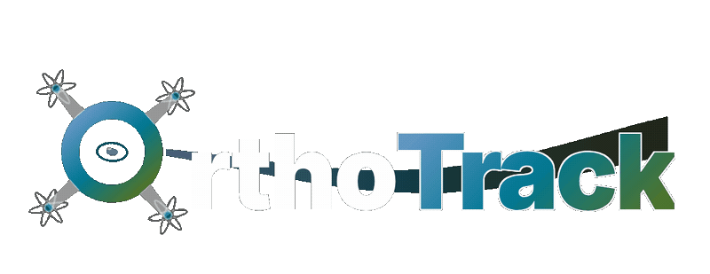

<div align="center">



<h1>OrthoTrack: Continuous 6-DoF UAV Trajectory Estimation Anchored in Public Orthophotos</h1>
<h2>ECCV 2026</h2>

<p>
  <a href="https://orthotrack.ethz.ch"></a>
  <a href="https://arxiv.org/abs/2606.25245"></a>
  <a href="https://huggingface.co/spaces/ussaema/orthotrack-demo"></a>
  <a href="https://github.com/cvg/orthotrack/stargazers"></a>
  <a href="LICENSE"></a>
</p>

**[Oussema Dhaouadi](https://ussaema.github.io)**<sup>1,2,3,4,*</sup>, **[Zuria Bauer](https://zuriabauer.com/)**<sup>1</sup>, **[Johannes Meier](https://www.linkedin.com/in/johannes-meier-52a159b4/)**<sup>2,4</sup>, <br>
**[Olaf Wysocki](https://olafwysocki.github.io/)**<sup>3</sup>, **[Marc Pollefeys](https://cvg.ethz.ch/team/Prof-Dr-Marc-Pollefeys)**<sup>1,5</sup>, **[Daniel Cremers](https://cvg.cit.tum.de/members/cremers)**<sup>2,4</sup>

<sup>1</sup> ETH Zurich &emsp; <sup>2</sup> TU Munich &emsp; <sup>3</sup> University of Cambridge <br>
<sup>4</sup> MCML &emsp; <sup>5</sup> Microsoft <br>
<sup>*</sup> Corresponding author

</div>

## Overview
OrthoTrack is a **training-free** system for **continuous, absolute, metrically scaled 6-DoF UAV trajectory estimation** using **public orthophotos** and **surface models** as map priors—without GPS and without post-hoc alignment.

---

## 🚀 How it works

1. **Keyframe Localization** — RoMa matches the UAV image against a DOP orthophoto crop. Correspondences are lifted to metric 3D via the DSM and solved with PnP (RANSAC).
2. **Inter-Frame Tracking** — Lucas-Kanade optical flow propagates the 2D–3D correspondences to subsequent frames, yielding an absolute metric pose at every frame.
3. **Re-localization** — When tracked points degrade, a new keyframe triggers another DOP match to anchor the trajectory.

---

## 🛠️ Installation

**Requirements:**
- Python ≥ 3.10
- CUDA GPU (required for the dense feature matcher)
  - **≥ 8 GB VRAM** — use `--fine_matcher turbo` (or `fast`)
  - **≥ 16 GB VRAM** — use default `--fine_matcher precise`
- `conda` or `venv` for environment management

```bash
git clone https://github.com/cvg/orthotrack.git
cd orthotrack

conda create -n orthotrack python=3.10 -y
conda activate orthotrack
# Install a CUDA build of PyTorch for your platform first if needed:
#   https://pytorch.org/get-started/locally/
bash setup.sh
```

`setup.sh` installs deps from `requirements.txt` (including Open3D, NumPy, and OpenCV versions needed for mesh rendering), clones [RoMaV2](https://github.com/Parskatt/RoMaV2) into `thirdparty/`, and installs it editable. RoMaV2 weights download on the first tracker run (`torch.hub`).

For headless mesh render (`dataset/create_movingdrone.py --render`), install EGL/OpenGL system libs if needed:

```bash
sudo apt-get install -y libegl1 libgles2 libgl1
```

> ⚠️ Set `PYTHONPATH=.` when running Python scripts from the project root.

---

## 📊 Datasets

See [dataset/README.md](dataset/README.md) for **MovingDrone**, **UAVD4L**, and **UAVScenes**.
To author new MovingDrone scenes (mesh + GES trajectory, or frames + priors), use `dataset/create_movingdrone.py` — see [dataset/movingdrone.md](dataset/movingdrone.md).

**Minimal MovingDrone download** (local path is always `scenes/`; the server hosts files under `sequences/`):

```bash
PYTHONPATH=. python -c "
from dataset.MovingDrone import MovingDrone
MovingDrone(dataset_dir='data/MovingDrone', sequences=['airport10'],
            predownload=True, load_dop=True, load_dsm=True)
"
```

---

## 🏃 Running OrthoTrack

> **CLI defaults:** `--fine_matcher precise`, `--coarse_matcher base`, `--skip_frames 1`, `--max_image_dim 1920`.  
> Examples below use `turbo` where noted for GPUs with ~8 GB VRAM.

### 1. On a Dataset Scene (recommended first run)
```bash
PYTHONPATH=. python scripts/run_tracking.py \
    --sequence_dir data/MovingDrone/scenes/airport10 \
    --fine_matcher turbo \
    --output outputs/tracking/airport10 \
    --end_frame 30 \
    --save_keyframe_vis
```

Drop `--end_frame` for the full video. On ≥16 GB VRAM, omit `--fine_matcher turbo` to use the default `precise` matcher.

### 2. On Custom User Data
Provide an MP4 (or frame folder), a GeoTIFF DOP, and a GeoTIFF DSM:

```bash
bash scripts/run_custom_data.sh path/to/video.mp4 path/to/ortho.tif path/to/dem.tif outputs/my_custom_flight
```

Or directly:
```bash
PYTHONPATH=. python scripts/run_tracking.py \
    --footage path/to/video.mp4 \
    --dop path/to/ortho.tif \
    --dsm path/to/dem.tif \
    --output outputs/my_custom_flight \
    --fine_matcher turbo \
    --save_keyframe_vis
```

Place `intrinsics.json` next to the video (or pass `--intrinsics`) when camera calibration is known; otherwise add `--force_calibration`.

### 3. Benchmarking on the Test Set
Loops over test scenes in `splits.json`:

```bash
PYTHONPATH=. python scripts/run_orthotrack_benchmark.py \
    --data_root data/MovingDrone \
    --output_dir outputs/benchmark \
    --fine_matcher turbo
```

Extra `run_tracking.py` flags (e.g. `--save_keyframe_vis`, `--flow_method raft`) are forwarded.

### 4. Evaluating Foundation Models & SLAM Baselines (optional)
Requires separate third-party installs — **not** covered by `setup.sh`. See **[EVALUATION.md](EVALUATION.md)**.

---

## ✅ Best practices for tracking quality

These settings matter more than matcher speed for accurate trajectories:

| Setting | Recommendation | Why |
|---------|----------------|-----|
| **DOP / DSM resolution (GSD)** | **≤ 0.2 m/px** (e.g. DOP20) | Coarse orthophotos (≥ 0.4 m/px) often cause large localization drift. DOP and DSM should share the same CRS and fully cover the flight. |
| **Video resolution** | Native resolution; avoid unnecessary upscaling | `--max_image_dim` (default `1920`) downscales large frames before matching. Very small inputs (≪ 720p) reduce match density. |
| **Frame rate / `--skip_frames`** | **`skip_frames 1`** (process every frame) | Optical-flow tracking needs temporal continuity. Use `--skip_frames 2+` only to save time; quality drops when frames are sparse. |
| **Matchers** | **`precise` + `base`** (defaults) | `turbo` / `fast` are faster but weaker; use them only when VRAM or latency requires it. |
| **Intrinsics** | Match video size, or `--force_calibration` | Wrong focal length / FoV breaks PnP even with good maps. |
| **Map coverage** | DOP + DSM overlap the entire trajectory | First-frame failure usually means the orthophoto crop does not cover the UAV footprint. |

**Interactive demo:** [Hugging Face Space](https://huggingface.co/spaces/ussaema/orthotrack-demo) — bundled examples use 0.2 m/px geodata and show live resolution warnings for custom uploads.

---

### 🔍 Common CLI options
| Flag | Default | Description |
|------|---------|-------------|
| `--fine_matcher` | `precise` | Fine-stage RoMa matcher (`turbo` / `fast` / `base` / `precise`). |
| `--coarse_matcher` | `base` | Coarse matcher for tile search and re-localization. |
| `--flow_method` | `lk` | Inter-frame tracker: `lk`, `waft`, or a ptlflow name (e.g. `raft`). |
| `--skip_frames` | `1` | Process every Nth frame (`1` = all frames). |
| `--max_image_dim` | `1920` | Downscale longest image side before matching (`0` = no limit). |
| `--force_calibration` | off | Ignore bundled intrinsics and sweep FoV on the first frame. |
| `--intrinsics` | auto | Path to `intrinsics.json` (also auto-read next to footage). |
| `--save_keyframe_vis` | off | Save 4-panel keyframe match visualizations. |
| `--lod_obj_dir` | off | LoD mesh (`.obj` / `.npz`) for wireframe overlay scripts. |
| `--end_frame` | all | Exclusive end index for partial runs / smoke tests. |

Run `PYTHONPATH=. python scripts/run_tracking.py --help` for the full argument list.

---

## 📁 Outputs

After processing a sequence, all data is saved to your specified `--output` directory:
- `results.csv` — Per-frame 6-DoF absolute metric pose estimates.
- `results.json` — Comprehensive log containing processing times, device info, and configurations.
- `tracking_results.png` — An overhead trajectory plot of the flight path.
- `keyframes/` — If `--save_keyframe_vis` is enabled, visualization images for each keyframe trigger.

---

## 🎬 LoD Mesh Overlay Video
OrthoTrack includes a standalone script to generate a video with 3D building wireframes dynamically projected onto the drone footage using the estimated 6-DoF poses.

Example overlays are shown on the [project page](https://orthotrack.ethz.ch). Generate one locally after tracking:

### On a Dataset Sequence
```bash
PYTHONPATH=. python scripts/visualize_results.py \
    --sequence_dir data/MovingDrone/scenes/airport10 \
    --results outputs/tracking/airport10/results.json \
    --output outputs/lod_overlay.mp4
```

### On Custom User Data
If you are using custom data, you can provide the video and a custom LoD mesh directly (.npz, .obj, or .ply):
```bash
PYTHONPATH=. python scripts/visualize_results.py \
    --video path/to/video.mp4 \
    --lod path/to/custom_mesh.ply \
    --results outputs/my_custom_flight/results.json \
    --output outputs/lod_overlay_custom.mp4
```

## 📜 Citation

If you use OrthoTrack or MovingDrone in your research, please cite:

```bibtex
@inproceedings{dhaouadi2026orthotrack,
  title     = {OrthoTrack: Continuous 6-DoF UAV Trajectory Estimation Anchored in Public Orthophotos},
  author    = {Dhaouadi, Oussema and Bauer, Zuria and Meier, Johannes and Wysocki, Olaf and Pollefeys, Marc and Cremers, Daniel},
  booktitle = {European Conference on Computer Vision (ECCV)},
  year      = {2026}
}
```

## ⚖️ License

This code is released under the [CC BY-NC 4.0](LICENSE) license (non-commercial use only).
Third-party components retain their original licenses.
